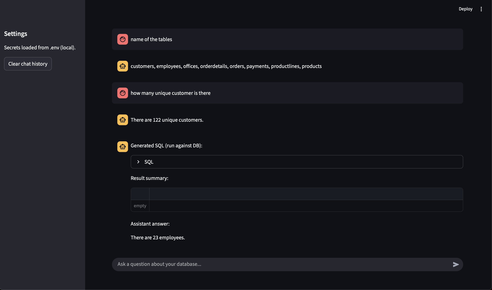

# Natural Language to SQL Conversion

## Overview

This project demonstrates a sophisticated approach to converting natural language questions into executable SQL queries. By leveraging the power of Large Language Models (LLMs) through the LangChain framework, this application provides a conversational interface for querying a relational database. The system is designed to be intuitive, allowing users to ask questions in plain English and receive not only the precise SQL query but also a clear, understandable answer derived from the database results.

This project is built with a focus on modularity and scalability, making it an excellent showcase of modern NLP and database interaction techniques. It's an ideal reference for demonstrating practical AI implementation in a technical interview setting.

## Features

- **Natural Language to SQL:** Translates complex English questions into syntactically correct MySQL queries.
- **Conversational AI:** Maintains conversation history to understand context for follow-up questions.
- **Database Agnostic:** While configured for MySQL, the use of SQLAlchemy and LangChain's SQL agent allows for easy adaptation to other SQL databases.
- **Web Interface:** A simple and intuitive web interface built with Streamlit for easy interaction and demonstration.
- **Detailed Responses:** Provides the generated SQL query, the raw results from the database, and a final, human-readable answer.
- **Few-Shot Prompting:** Utilizes few-shot examples within the prompt to guide the LLM in generating accurate and efficient queries.

## Tech Stack

- **Backend:** Python
- **Web Framework:** Streamlit
- **LLM Orchestration:** LangChain
- **LLM:** Google Gemini (via `langchain-google-genai`)
- **Database:** MySQL (interfaced with `pymysql` and `SQLAlchemy`)
- **Dependencies:** `pandas`, `python-dotenv`

## Setup and Installation

1.  **Clone the repository:**
    ```bash
    git clone <repository-url>
    cd Natural_Lang_to_SQL
    ```

2.  **Create and activate a virtual environment:**
    ```bash
    python3 -m venv venv
    source venv/bin/activate
    ```

3.  **Install the dependencies:**
    ```bash
    pip install -r requirements.txt
    ```

4.  **Set up environment variables:**
    Create a `.env` file in the root directory and add the following:
    ```
    DB_URI="mysql+pymysql://<user>:<password>@<host>/<database>"
    GOOGLE_API_KEY="your-google-api-key"
    GEMINI_MODEL="gemini-1.5-flash"
    ```

5.  **Database Schema:**
    The application expects a database with a schema described in `table_details.csv`. The sample database schema includes tables like `products`, `customers`, `orders`, etc. You can use the `mysql_sample_database.sql` file to set up a sample database.

## Usage

To run the Streamlit application, execute the following command in your terminal:

```bash
streamlit run app.py
```

This will start the web server and open the application in your browser. You can then interact with the application by typing your questions into the input box.

## Project Structure

```
.
├── app.py                  # Main Streamlit application
├── langchain_utils.py      # Core logic for LangChain agent and database interaction
├── prompts.py              # Prompt templates for the LLM
├── requirements.txt        # Python dependencies
├── table_details.csv       # Database schema information for the LLM
├── mysql_sample_database.sql # SQL script for sample database
└── .env                    # Environment variables (to be created)
```

## How It Works

The application follows a clear, multi-step process to answer a user's question:

1.  **User Input:** The user enters a question in the Streamlit web interface.

2.  **LangChain Agent:** The `handle_question` function in `langchain_utils.py` is called. This function initializes a LangChain SQL agent (`create_sql_agent`). This agent is a specialized component that knows how to interact with a SQL database.

3.  **Prompt Engineering:** The agent uses a prompt template (`SQL_GENERATION_PROMPT` from `prompts.py`) to construct a detailed prompt for the LLM. This prompt includes:
    - The user's question.
    - The database schema from `table_details.csv`.
    - Few-shot examples of questions and their corresponding SQL queries to guide the LLM.
    - The conversation history to provide context.

4.  **LLM Interaction:** The prompt is sent to the Google Gemini model. The LLM processes the prompt and generates a MySQL query.

5.  **SQL Execution:** The LangChain agent receives the SQL query from the LLM and executes it against the database using the `SQLDatabaseToolkit`.

6.  **Final Answer Generation:** The agent then uses a second prompt (`FINAL_ANSWER_PROMPT`) to generate a human-readable answer. This prompt includes the original question, the generated SQL, and the result of the SQL query.

7.  **Display Results:** The `app.py` script displays the final answer, the SQL query, and the raw database results in the Streamlit interface.

# Screenshot

